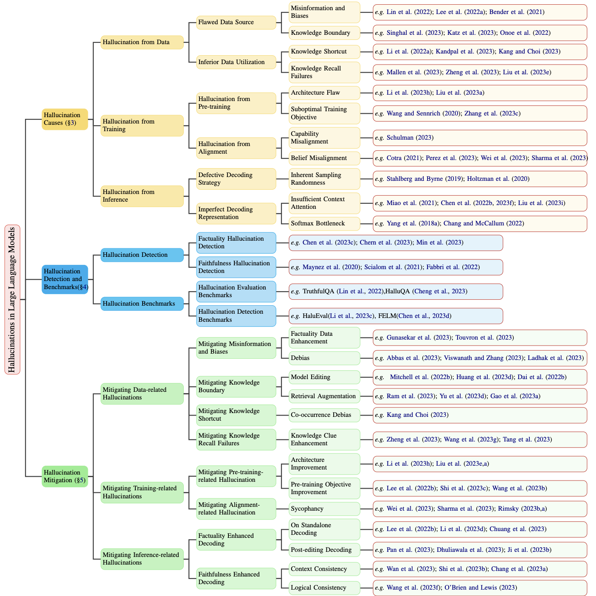
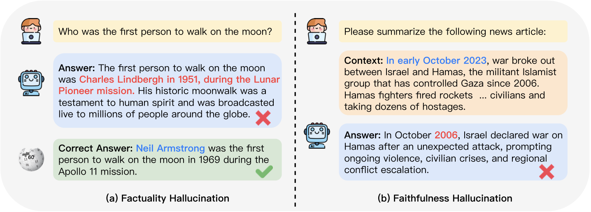

<div align="center">
<h2>
A Survey on Hallucination in Large Language Models: 
Principles, Taxonomy, Challenges, and Open Questions
</h2>
</div>

<div align="center">
<b>Lei Huang</b><sup>1∗</sup>,
<b>Weijiang Yu</b><sup>2∗</sup>,
<b>Weitao Ma</b><sup>1</sup>,
<b>Weihong Zhong</b><sup>1</sup>,
<b>Zhangyin Feng</b><sup>1</sup>,
<b>Haotian Wang</b><sup>1</sup>,
<b>Qianglong Chen</b><sup>2</sup>,
<b>Weihua Peng</b><sup>2</sup>,
<b>Xiaocheng Feng</b><sup>1†</sup>,
<b>Bing Qin</b><sup>1</sup>,
<b>Ting Liu</b><sup>1</sup>
</div>

<div align="center">
<sup>1</sup>Harbin Institute of Technology, Harbin, China
</div>
<div align="center">
<sup>2</sup>Huawei Inc., Shenzhen, China
</div>

This repository contains the resources for our survey paper.

[](https://awesome.re)[](./LICENSE)

<p align=center>
    
    <br>
    <em>The main content flow and categorization of this survey.</em>
</p>

## :tada: Updates
- 2023/11/09 The first version of our paper is available on [arXiv](https://arxiv.org/abs/2311.05232)

## :page_with_curl: Papers

We have surveyed papers related to Large Language Model hallucination. This includes **related survey or analytical papers**, **hallucination causes**, **hallucination detection and benchmarks**, **hallucination mitigation**, as well as **challenges and open questions** in the field.

### :memo:Related Survey / Analytical Papers

> We provide a curated list of survey papers that delve into the topic of hallucination in LLMs.

#### Related Survey papers

1. **Survey of Hallucination in Natural Language Generation** `ACM Computing Surveys 2023 `

   *Ziwei Ji, Nayeon Lee, Rita Frieske, Tiezheng Yu, Dan Su, Yan Xu, Etsuko Ishii, Yejin Bang, Wenliang Dai, Andrea Madotto, Pascale Fung* [[paper]](https://arxiv.org/abs/2202.03629) 2022.02

2. **Trustworthy LLMs: a Survey and Guideline for Evaluating Large Language Models' Alignment** `arXiv 2023`

   *Yang Liu, Yuanshun Yao, Jean-Francois Ton, Xiaoying Zhang, Ruocheng Guo, Hao Cheng, Yegor Klochkov, Muhammad Faaiz Taufiq, Hang Li* [[paper]](https://arxiv.org/abs/2308.05374) 2023.08

3. **Siren's Song in the AI Ocean: A Survey on Hallucination in Large Language Models** `arXiv 2023`

   *Yue Zhang, Yafu Li, Leyang Cui, Deng Cai, Lemao Liu, Tingchen Fu, Xinting Huang, Enbo Zhao, Yu Zhang, Yulong Chen, Longyue Wang, Anh Tuan Luu, Wei Bi, Freda Shi, Shuming Shi* [[paper]](https://arxiv.org/abs/2309.01219) 2023.09

4. **Cognitive Mirage: A Review of Hallucinations in Large Language Models** `arXiv 2023`

   *Hongbin Ye, Tong Liu, Aijia Zhang, Wei Hua, Weiqiang Jia* [[paper]](https://arxiv.org/abs/2309.06794) 2023.09

5. **A Survey of Hallucination in Large Foundation Models** `arXiv 2023`

   *Vipula Rawte, Amit Sheth, Amitava Das* [[paper]](https://arxiv.org/abs/2309.05922) 2023.09

6. **Augmenting LLMs with Knowledge: A survey on hallucination prevention** `arXiv 2023`

   *Konstantinos Andriopoulos, Johan Pouwelse* [[paper]](https://arxiv.org/abs/2309.16459) 2023.09

7. **Survey on Factuality in Large Language Models: Knowledge, Retrieval and Domain-Specificity** `arXiv 2023`

   *Cunxiang Wang, Xiaoze Liu, Yuanhao Yue, Xiangru Tang, Tianhang Zhang, Cheng Jiayang, Yunzhi Yao, Wenyang Gao, Xuming Hu, Zehan Qi, Yidong Wang, Linyi Yang, Jindong Wang, Xing Xie, Zheng Zhang, Yue Zhang* [[paper]](https://arxiv.org/abs/2310.07521) 2023.10

8. **Insights into Classifying and Mitigating LLMs' Hallucinations** `AIxIA 2023`

   *Alessandro Bruno, Pier Luigi Mazzeo, Aladine Chetouani, Marouane Tliba, Mohamed Amine Kerkouri* [[paper]](https://arxiv.org/abs/2311.08117) 2023.11

#### Related Analytical papers

1. **A Multitask, Multilingual, Multimodal Evaluation of ChatGPT on Reasoning, Hallucination, and Interactivity** `arXiv 2023`

   *Yejin Bang, Samuel Cahyawijaya, Nayeon Lee, Wenliang Dai, Dan Su, Bryan Wilie, Holy Lovenia, Ziwei Ji, Tiezheng Yu, Willy Chung, Quyet V. Do, Yan Xu, Pascale Fung* [[paper]](https://arxiv.org/abs/2302.04023) 2023.02

2. **Hallucinations in Large Multilingual Translation Models** `arXiv 2023`

   *Nuno M. Guerreiro, Duarte Alves, Jonas Waldendorf, Barry Haddow, Alexandra Birch, Pierre Colombo, André F. T. Martins* [[paper]](https://arxiv.org/abs/2303.16104) 2023.03

3. **Challenges and Applications of Large Language Models** `arXiv 2023`

   *Jean Kaddour, Joshua Harris, Maximilian Mozes, Herbie Bradley, Roberta Raileanu, Robert McHardy* [[paper]](https://arxiv.org/abs/2307.10169) 2023.07

4. **Beyond Factuality: A Comprehensive Evaluation of Large Language Models as Knowledge Generators** `EMNLP 2023`

   *Liang Chen, Yang Deng, Yatao Bian, Zeyu Qin, Bingzhe Wu, Tat-Seng Chua, Kam-Fai Wong* [[paper]](https://arxiv.org/abs/2310.07289) 2023.10

### :imp:Category of LLM Hallucination

<p align=center>
    
    <br>
    <em>Two primary types of hallucination: factuality hallucination and faithfulness hallucination.</em>
</p>


### :question:Hallucination Causes

> We categorize the causes of hallucinations into three main aspects: **data**, **model training**, and **model inference**.

#### Hallucination from Data 

---

**Flawed Data Source**

1. **On the Dangers of Stochastic Parrots: Can Language Models Be Too Big?** `ACM FAccT 2021`

   *Emily M. Bender, Timnit Gebru, Angelina McMillan-Major, Shmargaret Shmitchell* [[paper]](https://dl.acm.org/doi/10.1145/3442188.3445922) 2021.03

2. **Ethical and social risks of harm from Language Models** `arXiv 2021`

   *Laura Weidinger, John Mellor, Maribeth Rauh, Conor Griffin, Jonathan Uesato, Po-Sen Huang, Myra Cheng, Mia Glaese, Borja Balle, Atoosa Kasirzadeh, Zac Kenton, Sasha Brown, Will Hawkins, Tom Stepleton, Courtney Biles, Abeba Birhane, Julia Haas, Laura Rimell, Lisa Anne Hendricks, William Isaac, Sean Legassick, Geoffrey Irving, Iason Gabriel* [[paper]](https://arxiv.org/abs/2112.04359) 2021.12

3. **TruthfulQA: Measuring How Models Mimic Human Falsehoods** `ACL 2022`

   *Stephanie Lin, Jacob Hilton, Owain Evans* [[paper]](https://arxiv.org/abs/2109.07958) 2021.09

4. **Deduplicating Training Data Makes Language Models Better** `ACL 2022`

   *Katherine Lee, Daphne Ippolito, Andrew Nystrom, Chiyuan Zhang, Douglas Eck, Chris Callison-Burch, Nicholas Carlini* [[paper]](https://aclanthology.org/2022.acl-long.577/) 2021.07

5. **Data and its (dis)contents: A survey of dataset development and use in machine learning research** `Patterns`

   *Amandalynne Paullada, Inioluwa Deborah Raji, Emily M. Bender, Emily Denton, Alex Hanna* [[paper]](https://www.cell.com/patterns/pdf/S2666-3899(21)00184-7.pdf) 2020.12

6. **Nationality Bias in Text Generation** `EACL 2023`

   *Pranav Narayanan Venkit, Sanjana Gautam, Ruchi Panchanadikar, Ting-Hao 'Kenneth' Huang, Shomir Wilson* [[paper]](https://arxiv.org/abs/2302.02463) 2023.02

7. **When Do Pre-Training Biases Propagate to Downstream Tasks? A Case Study in Text Summarization** `EACL 2023`

   *Faisal Ladhak, Esin Durmus, Mirac Suzgun, Tianyi Zhang, Dan Jurafsky, Kathleen McKeown, Tatsunori Hashimoto* [[paper]](https://aclanthology.org/2023.eacl-main.234/) 2023.02

8. **Entity Cloze By Date: What LMs Know About Unseen Entities** `NAACL 2022 findings`

   *Yasumasa Onoe, Michael Zhang, Eunsol Choi, Greg Durrett* [[paper]](https://aclanthology.org/2022.findings-naacl.52/) 2022.05

**Inferior Data Utilization**

1. **How Pre-trained Language Models Capture Factual Knowledge? A Causal-Inspired Analysis** `ACL 2022 findings`

   *Shaobo Li, Xiaoguang Li, Lifeng Shang, Zhenhua Dong, Chengjie Sun, Bingquan Liu, Zhenzhou Ji, Xin Jiang, Qun Liu* [[paper]](https://arxiv.org/abs/2203.16747) 2022.03

2. **Large Language Models Struggle to Learn Long-Tail Knowledge** `ICML 2023`

   *Nikhil Kandpal, Haikang Deng, Adam Roberts, Eric Wallace, Colin Raffel* [[paper]](https://arxiv.org/abs/2211.08411) 2022.11

3. **Impact of Co-occurrence on Factual Knowledge of Large Language Models** `EMNLP 2023 findings`

   *Cheongwoong Kang, Jaesik Choi* [[paper]](https://arxiv.org/abs/2310.08256) 2023.10

4. **When Not to Trust Language Models: Investigating Effectiveness of Parametric and Non-Parametric Memories** `ACL 2023`

   *Alex Mallen, Akari Asai, Victor Zhong, Rajarshi Das, Daniel Khashabi, Hannaneh Hajishirzi* [[paper]](https://arxiv.org/abs/2212.10511) 2022.12

5. **Why Does ChatGPT Fall Short in Providing Truthful Answers?** `arXiv 2023`

   *Shen Zheng, Jie Huang, Kevin Chen-Chuan Chang* [[paper]](https://arxiv.org/abs/2304.10513) 2023.04

6. **The Reversal Curse: LLMs trained on "A is B" fail to learn "B is A"** `arXiv 2023`

   *Lukas Berglund, Meg Tong, Max Kaufmann, Mikita Balesni, Asa Cooper Stickland, Tomasz Korbak, Owain Evans* [[paper]](https://arxiv.org/abs/2309.12288) 2023.09

#### Hallucination from Training

---

**Hallucination from Pre-training**

1. **Exposing Attention Glitches with Flip-Flop Language Modeling** `arXiv 2023`

   *Bingbin Liu, Jordan T. Ash, Surbhi Goel, Akshay Krishnamurthy, Cyril Zhang* [[paper]](https://arxiv.org/abs/2306.00946) 2023.06

2. **On Exposure Bias, Hallucination and Domain Shift in Neural Machine Translation** `ACL 2020`

   *Chaojun Wang, Rico Sennrich* [[paper]](https://aclanthology.org/2020.acl-main.326/) 2020.05

3. **How Language Model Hallucinations Can Snowball** `arXiv 2023`

   *Muru Zhang, Ofir Press, William Merrill, Alisa Liu, Noah A. Smith* [[paper]](https://arxiv.org/abs/2305.13534) 2023.05

**Hallucination from Alignment**

1. **Reinforcement Learning from Human Feedback: Progress and Challenges** `Youtube`

   *John Schulman* [[video]](https://www.youtube.com/watch?v=hhiLw5Q_UFg) 2023.04

2. **Reinforcement Learning for Language Models** `Github Gist`

   *Yoav Goldberg* [[note]](https://gist.github.com/yoavg/6bff0fecd65950898eba1bb321cfbd81) 2023.04

3. **Discovering Language Model Behaviors with Model-Written Evaluations** `ACL 2023 findings`

   *Ethan Perez, Sam Ringer, Kamile Lukosiute, Karina Nguyen, Edwin Chen, Scott Heiner, Craig Pettit, Catherine Olsson, Sandipan Kundu, Saurav Kadavath, Andy Jones, Anna Chen, Benjamin Mann, Brian Israel, Bryan Seethor, Cameron McKinnon, Christopher Olah, Da Yan, Daniela Amodei, Dario Amodei, Dawn Drain, Dustin Li, Eli Tran-Johnson, Guro Khundadze, Jackson Kernion, James Landis, Jamie Kerr, Jared Mueller, Jeeyoon Hyun, Joshua Landau, Kamal Ndousse, Landon Goldberg, Liane Lovitt, Martin Lucas, Michael Sellitto, Miranda Zhang, Neerav Kingsland, Nelson Elhage, Nicholas Joseph, Noemi Mercado, Nova DasSarma, Oliver Rausch, Robin Larson, Sam McCandlish, Scott Johnston, Shauna Kravec, Sheer El Showk, Tamera Lanham, Timothy Telleen-Lawton, Tom Brown, Tom Henighan, Tristan Hume, Yuntao Bai, Zac Hatfield-Dodds, Jack Clark, Samuel R. Bowman, Amanda Askell, Roger Grosse, Danny Hernandez, Deep Ganguli, Evan Hubinger, Nicholas Schiefer, Jared Kaplan* [[paper]](https://aclanthology.org/2023.findings-acl.847/) 2022.12

4. **Towards Understanding Sycophancy in Language Models** `arXiv 2023`

   *Mrinank Sharma, Meg Tong, Tomasz Korbak, David Duvenaud, Amanda Askell, Samuel R. Bowman, Newton Cheng, Esin Durmus, Zac Hatfield-Dodds, Scott R. Johnston, Shauna Kravec, Timothy Maxwell, Sam McCandlish, Kamal Ndousse, Oliver Rausch, Nicholas Schiefer, Da Yan, Miranda Zhang, Ethan Perez* [[paper]](https://arxiv.org/abs/2310.13548) 2023.10

#### Hallucination from Inference

---

**Inherent Sampling Randomness**

1. **Neural Path Hunter: Reducing Hallucination in Dialogue Systems via Path Grounding** `EMNLP 2021`

   *Nouha Dziri, Andrea Madotto, Osmar Zaïane, Avishek Joey Bose* [[paper]](https://aclanthology.org/2021.emnlp-main.168/) 2021.04

2. **Factuality Enhanced Language Models for Open-Ended Text Generation** `NeurIPS 20222`

   *Nayeon Lee, Wei Ping, Peng Xu, Mostofa Patwary, Pascale Fung, Mohammad Shoeybi, Bryan Catanzaro* [[paper]](https://arxiv.org/abs/2206.04624) 2022.06

3. **Characterizing Attribution and Fluency Tradeoffs for Retrieval-Augmented Large Language Models** `arXiv 2023`

   *Renat Aksitov, Chung-Ching Chang, David Reitter, Siamak Shakeri, Yunhsuan Sung* [[paper]](https://arxiv.org/abs/2302.05578) 2023.02

**Imperfect Decoding Representation**

1. **Prevent the Language Model from being Overconfident in Neural Machine Translation** `ACL 2021`

   *Mengqi Miao, Fandong Meng, Yijin Liu, Xiao-Hua Zhou, Jie Zhou* [[paper]](https://aclanthology.org/2021.acl-long.268/) 2021.05

2. **Towards Improving Faithfulness in Abstractive Summarization** `NeurIPS 2022`

   *Xiuying Chen, Mingzhe Li, Xin Gao, Xiangliang Zhang* [[paper]](https://arxiv.org/abs/2210.01877) 2022.10

3. **Instruction Position Matters in Sequence Generation with Large Language Models** `arXiv 2023`

   *Yijin Liu, Xianfeng Zeng, Fandong Meng, Jie Zhou* [[paper]](https://arxiv.org/abs/2308.12097) 2023.08

4. **Breaking the Softmax Bottleneck: A High-Rank RNN Language Model** `ICLR 2018`

   *Zhilin Yang, Zihang Dai, Ruslan Salakhutdinov, William W. Cohen* [[paper]](https://openreview.net/pdf?id=HkwZSG-CZ) 2017.11

5. **Softmax Bottleneck Makes Language Models Unable to Represent Multi-mode Word Distributions** `ACL 2022`

   *Haw-Shiuan Chang, Andrew McCallum* [[paper]](https://aclanthology.org/2022.acl-long.554/) 2022.05

6. **The Curious Case of Hallucinatory (Un)answerability: Finding Truths in the Hidden States of Over-Confident Large Language Models** `EMNLP 2023`

   *Aviv Slobodkin, Omer Goldman, Avi Caciularu, Ido Dagan, Shauli Ravfogel* [[paper]](https://aclanthology.org/2023.emnlp-main.220/) 2023.12

###  :100:Hallucination Detection and Benchmarks

> We offer a detailed overview of the current methodologies for detecting hallucinations, specifically focusing on **factuality** and **faithfulness**. Additionally, we review the relevant benchmarks, which are principally divided into two categories: **hallucination evaluation benchmarks** and **hallucination detection benchmarks**

#### Hallucination Detection

---

**Factuality Hallucination Detection**

##### Retrieve External Facts

1. **Complex Claim Verification with Evidence Retrieved in the Wild** `arXiv 2023`

   *Jifan Chen, Grace Kim, Aniruddh Sriram, Greg Durrett, Eunsol Choi* [[paper]](https://arxiv.org/abs/2305.11859) 2023.05

2. **Beyond Factuality: A Comprehensive Evaluation of Large Language Models as Knowledge Generators** `EMNLP 2023`

   *Liang Chen, Yang Deng, Yatao Bian, Zeyu Qin, Bingzhe Wu, Tat-Seng Chua, Kam-Fai Wong* [[paper]](https://arxiv.org/abs/2310.07289) 2023.10

3. **FActScore: Fine-grained Atomic Evaluation of Factual Precision in Long Form Text Generation** `arXiv 2023`

   *Sewon Min, Kalpesh Krishna, Xinxi Lyu, Mike Lewis, Wen-tau Yih, Pang Wei Koh, Mohit Iyyer, Luke Zettlemoyer, Hannaneh Hajishirzi* [[paper]](https://arxiv.org/abs/2305.14251) 2023.05

4. **Fact-Checking Complex Claims with Program-Guided Reasoning** `ACL 2023`

   *Liangming Pan, Xiaobao Wu, Xinyuan Lu, Anh Tuan Luu, William Yang Wang, Min-Yen Kan, Preslav Nakov* [[paper]](https://arxiv.org/abs/2305.12744) 2023.05

5. **Zero-shot Faithful Factual Error Correction** `ACL 20023`

   *Kung-Hsiang Huang, Hou Pong Chan, Heng Ji* [[paper]](https://arxiv.org/abs/2305.07982) 2023.05

6. **FACTKG: Fact Verification via Reasoning on Knowledge Graphs** `ACL 2023`

   *Jiho Kim, Sungjin Park, Yeonsu Kwon, Yohan Jo, James Thorne, Edward Choi* [[paper]](https://arxiv.org/abs/2305.06590) 2023.05

7. **Retrieving Supporting Evidence for LLMs Generated Answers** `arXiv 2023`

   *Siqing Huo, Negar Arabzadeh, Charles L. A. Clarke* [[paper]](https://arxiv.org/abs/2306.13781) 2023.06

8. **A Stitch in Time Saves Nine: Detecting and Mitigating Hallucinations of LLMs by Validating Low-Confidence Generation** `arXiv 2023`

   *Neeraj Varshney, Wenlin Yao, Hongming Zhang, Jianshu Chen, Dong Yu* [[paper]](https://arxiv.org/abs/2307.03987) 2023.07

9. **FacTool: Factuality Detection in Generative AI -- A Tool Augmented Framework for Multi-Task and Multi-Domain Scenarios** `arXiv 2023`

   *I-Chun Chern, Steffi Chern, Shiqi Chen, Weizhe Yuan, Kehua Feng, Chunting Zhou, Junxian He, Graham Neubig, Pengfei Liu* [[paper]](https://arxiv.org/abs/2307.13528) 2023.07

10. **Truth-O-Meter: Collaborating with LLM in Fighting its Hallucinations** `arXiv 2023`

    *Boris A. Galitsky* [[paper]](https://www.preprints.org/manuscript/202307.1723/v1) 2023.07

11. **KCTS: Knowledge-Constrained Tree Search Decoding with Token-Level Hallucination Detection** `EMNLP 2023`

    *Sehyun Choi, Tianqing Fang, Zhaowei Wang, Yangqiu Song* [[paper]](https://arxiv.org/abs/2310.09044) 2023.10

12. **FactCHD: Benchmarking Fact-Conflicting Hallucination Detection** `arXiv 2023`

    *Xiang Chen, Duanzheng Song, Honghao Gui, Chengxi Wang, Ningyu Zhang, Fei Huang, Chengfei Lv, Dan Zhang, Huajun Chen* [[paper]](https://arxiv.org/abs/2310.12086) 2023.10

13. **Knowledge-Augmented Language Model Verification** `EMNLP 2023`

    *Jinheon Baek, Soyeong Jeong, Minki Kang, Jong C. Park, Sung Ju Hwang* [[paper]](https://arxiv.org/abs/2310.12836) 2023.10

##### Uncertainty Estimation

1. **SelfCheckGPT: Zero-Resource Black-Box Hallucination Detection for Generative Large Language Models** `arXiv 2023`

   *Potsawee Manakul, Adian Liusie, Mark J. F. Gales* [[paper]](https://arxiv.org/abs/2303.08896) 2023.03

2. **LM vs LM: Detecting Factual Errors via Cross Examination** `arXiv 2023`

   *Roi Cohen, May Hamri, Mor Geva, Amir Globerson* [[paper]](https://arxiv.org/abs/2305.13281) 2023.05

3. **Do Language Models Know When They're Hallucinating References?** `arXiv 2023`

   *Ayush Agrawal, Lester Mackey, Adam Tauman Kalai* [[paper]](https://arxiv.org/abs/2305.18248) 2023.05

4. **Can LLMs Express Their Uncertainty? An Empirical Evaluation of Confidence Elicitation in LLMs** `arXiv 2023`

   *Miao Xiong, Zhiyuan Hu, Xinyang Lu, Yifei Li, Jie Fu, Junxian He, Bryan Hooi* [[paper]](https://arxiv.org/abs/2306.13063) 2023.06

5. **Zero-Resource Hallucination Prevention for Large Language Models** `arXiv 2023`

   *Junyu Luo, Cao Xiao, Fenglong Ma* [[paper]](https://arxiv.org/abs/2309.02654) 2023.09

6. **LLM Lies: Hallucinations are not Bugs, but Features as Adversarial Examples** `arXiv 2023`

   *Jia-Yu Yao, Kun-Peng Ning, Zhen-Hui Liu, Mu-Nan Ning, Li Yuan* [[paper]](https://arxiv.org/abs/2310.01469) 2023.10

**Faithfulness Hallucination Detection**

##### Fact-based Metrics

1. **Towards Faithful Neural Table-to-Text Generation with Content-Matching Constraints** `ACL 2020`

   *Zhenyi Wang, Xiaoyang Wang, Bang An, Dong Yu, Changyou Chen* [[paper]](https://aclanthology.org/2020.acl-main.101/) 2020.07

2. **Entity-level Factual Consistency of Abstractive Text Summarization** `EACL 2021`

   *Feng Nan, Ramesh Nallapati, Zhiguo Wang, Cicero Nogueira dos Santos, Henghui Zhu, Dejiao Zhang, Kathleen McKeown, Bing Xiang* [[paper]](https://aclanthology.org/2021.eacl-main.235/) 2021.04

3. **Assessing The Factual Accuracy of Generated Text** `KDD 2019`

   *Ben Goodrich, Vinay Rao, Peter J. Liu, and Mohammad Saleh* [[paper]](https://dl.acm.org/doi/10.1145/3292500.3330955) 2019.08

##### Classifier-based Metrics

1. **Ranking Generated Summaries by Correctness: An Interesting but Challenging Application for Natural Language Inference** `ACL 2019`

   *Tobias Falke, Leonardo F. R. Ribeiro, Prasetya Ajie Utama, Ido Dagan, Iryna Gurevych* [[paper]](https://aclanthology.org/P19-1213/) 2019.07

2. **Looking Beyond Sentence-Level Natural Language Inference for Question Answering and Text Summarization** `NAACL 2021`

   *Anshuman Mishra, Dhruvesh Patel, Aparna Vijayakumar, Xiang Lorraine Li, Pavan Kapanipathi, Kartik Talamadupula* [[paper]](https://aclanthology.org/2021.naacl-main.104/) 2021.06

3. **Adversarial NLI for Factual Correctness in Text Summarisation Models** `arXiv 2020`

   *Mario Barrantes, Benedikt Herudek, Richard Wang* [[paper]](https://arxiv.org/abs/2005.11739) 2020.05

4. **Evaluating Factuality in Generation with Dependency-level Entailment** `EMNLP 2020 findings`

   *Tanya Goyal, Greg Durrett* [[paper]](https://aclanthology.org/2020.findings-emnlp.322/) 2020.11

5. **SummaC: Re-Visiting NLI-based Models for Inconsistency Detection in Summarization** `TACL 2022`

   *Philippe Laban, Tobias Schnabel, Paul N. Bennett, Marti A. Hearst* [[paper]](https://direct.mit.edu/tacl/article/doi/10.1162/tacl_a_00453/109470/SummaC-Re-Visiting-NLI-based-Models-for) 2021.11

6. **Knowledge-Augmented Language Model Verification** `EMNLP 2023`

    *Jinheon Baek, Soyeong Jeong, Minki Kang, Jong C. Park, Sung Ju Hwang* [[paper]](https://arxiv.org/abs/2310.12836) 2023.10

##### Question Answering-based Metrics

1. **FEQA: A Question Answering Evaluation Framework for Faithfulness Assessment in Abstractive Summarization** `ACL 2020`

   *Esin Durmus, He He, Mona Diab* [[paper]](https://aclanthology.org/2020.acl-main.454/) 2020.07

2. **Asking and Answering Questions to Evaluate the Factual Consistency of Summaries** `ACL 2020`

   *Alex Wang, Kyunghyun Cho, Mike Lewis* [[paper]](https://aclanthology.org/2020.acl-main.450/) 2020.07

3. **QuestEval: Summarization Asks for Fact-based Evaluation** `EMNLP 2021`

   *Thomas Scialom, Paul-Alexis Dray, Sylvain Lamprier, Benjamin Piwowarski, Jacopo Staiano, Alex Wang, Patrick Gallinari* [[paper]](https://aclanthology.org/2021.emnlp-main.529/) 2021.11

4. **Q2: Evaluating Factual Consistency in Knowledge-Grounded Dialogues via Question Generation and Question Answering** `EMNLP 2021`

   *Or Honovich, Leshem Choshen, Roee Aharoni, Ella Neeman, Idan Szpektor, Omri Abend* [[paper]](https://aclanthology.org/2021.emnlp-main.619/) 2021.11

5. **QAFactEval: Improved QA-Based Factual Consistency Evaluation for Summarization** `NAACL 2022`

   *Alexander Fabbri, Chien-Sheng Wu, Wenhao Liu, Caiming Xiong* [[paper]](https://aclanthology.org/2022.naacl-main.187/) 2022.07

##### Uncertainty Estimation

1. **On Hallucination and Predictive Uncertainty in Conditional Language Generation** `EACL 2021`

   *Yijun Xiao, William Yang Wang* [[paper]](https://aclanthology.org/2021.eacl-main.236/) 2021.04

2. **Looking for a Needle in a Haystack: A Comprehensive Study of Hallucinations in Neural Machine Translation** `EACL 2023`

   *Nuno M. Guerreiro, Elena Voita, André Martins* [[paper]](https://aclanthology.org/2023.eacl-main.75/) 2023.05

3. **Self-Checker: Plug-and-Play Modules for Fact-Checking with Large Language Models** `arXiv 2023`

   *Miaoran Li, Baolin Peng, Zhu Zhang* [[paper]](https://arxiv.org/abs/2305.14623) 2023.05

4. **Optimal Transport for Unsupervised Hallucination Detection in Neural Machine Translation** `ACL 2023`

   *Nuno M. Guerreiro, Pierre Colombo, Pablo Piantanida, André F. T. Martins* [[paper]](https://arxiv.org/abs/2212.09631) 2022.12

##### Prompting-based Metrics

1. **ChatGPT as a Factual Inconsistency Evaluator for Text Summarization** `arXiv 2023`

   *Zheheng Luo, Qianqian Xie, Sophia Ananiadou* [[paper]](https://arxiv.org/abs/2303.15621) 2023.03

2. **Human-like Summarization Evaluation with ChatGPT** `arXiv 2023`

   *Mingqi Gao, Jie Ruan, Renliang Sun, Xunjian Yin, Shiping Yang, Xiaojun Wan* [[paper]](https://arxiv.org/abs/2304.02554) 2023.04

3. **LLMs as Factual Reasoners: Insights from Existing Benchmarks and Beyond** `arXiv 2023`

   *Philippe Laban, Wojciech Kryściński, Divyansh Agarwal, Alexander R. Fabbri, Caiming Xiong, Shafiq Joty, Chien-Sheng Wu* [[paper]](https://arxiv.org/abs/2305.14540) 2023.05

4. **Multi-Dimensional Evaluation of Text Summarization with In-Context Learning** `ACL 2023 findings`

   *Sameer Jain, Vaishakh Keshava, Swarnashree Mysore Sathyendra, Patrick Fernandes, Pengfei Liu, Graham Neubig, Chunting Zhou* [[paper]](https://arxiv.org/abs/2306.01200) 2023.06

5. **Evaluating Correctness and Faithfulness of Instruction-Following Models for Question Answering** `arXiv 2023`

   *Vaibhav Adlakha, Parishad BehnamGhader, Xing Han Lu, Nicholas Meade, Siva Reddy* [[paper]](https://arxiv.org/abs/2307.16877) 2023.07

#### Hallucination Benchmarks

---

**Hallucination Evaluation Benchmarks**

1. **TruthfulQA: Measuring How Models Mimic Human Falsehoods** `ACL 2022`

   *Stephanie Lin, Jacob Hilton, Owain Evans* [[paper]](https://arxiv.org/abs/2109.07958) 2021.09

2. **RealTime QA: What's the Answer Right Now?** `arXiv 2022`

   *Jungo Kasai, Keisuke Sakaguchi, Yoichi Takahashi, Ronan Le Bras, Akari Asai, Xinyan Yu, Dragomir Radev, Noah A. Smith, Yejin Choi, Kentaro Inui* [[paper]](https://arxiv.org/abs/2207.13332) 2022.07

3. **Med-HALT: Medical Domain Hallucination Test for Large Language Models** `arXiv 2023`

   *Logesh Kumar Umapathi, Ankit Pal, Malaikannan Sankarasubbu* [[paper]](https://arxiv.org/abs/2307.15343) 2023.07

4. **Generating Benchmarks for Factuality Evaluation of Language Models** `arXiv 2023`

   *Dor Muhlgay, Ori Ram, Inbal Magar, Yoav Levine, Nir Ratner, Yonatan Belinkov, Omri Abend, Kevin Leyton-Brown, Amnon Shashua, Yoav Shoham* [[paper]](https://arxiv.org/abs/2307.06908) 2023.07

5. **ChineseFactEval: A Factuality Benchmark for Chinese LLMs** `report`

   *Binjie Wang, Ethan Chern, Pengfei Liu* [[github]](https://gair-nlp.github.io/ChineseFactEval/) 2023.09

6. **Evaluating Hallucinations in Chinese Large Language Models** `arXiv 2023`

   *Qinyuan Cheng, Tianxiang Sun, Wenwei Zhang, Siyin Wang, Xiangyang Liu, Mozhi Zhang, Junliang He, Mianqiu Huang, Zhangyue Yin, Kai Chen, Xipeng Qiu* [[paper]](https://arxiv.org/abs/2310.03368) 2023.10

7. **FreshLLMs: Refreshing Large Language Models with Search Engine Augmentation** `arXiv 2023`

   *Tu Vu, Mohit Iyyer, Xuezhi Wang, Noah Constant, Jerry Wei, Jason Wei, Chris Tar, Yun-Hsuan Sung, Denny Zhou, Quoc Le, Thang Luong* [[paper]](https://arxiv.org/abs/2310.03214) 2023.10

**Hallucination Detection Benchmarks**

1. **SelfCheckGPT: Zero-Resource Black-Box Hallucination Detection for Generative Large Language Models** `EMNLP 2023`

   *Potsawee Manakul, Adian Liusie, Mark J. F. Gales* [[paper]](https://arxiv.org/abs/2303.08896) 2023.03

2. **HaluEval: A Large-Scale Hallucination Evaluation Benchmark for Large Language Models** `EMNLP 2023`

   *Junyi Li, Xiaoxue Cheng, Wayne Xin Zhao, Jian-Yun Nie, Ji-Rong Wen* [[paper]](https://arxiv.org/abs/2305.11747) 2023.05

3. **HalOmi: A Manually Annotated Benchmark for Multilingual Hallucination and Omission Detection in Machine Translation** `arXiv 2023`

   *David Dale, Elena Voita, Janice Lam, Prangthip Hansanti, Christophe Ropers, Elahe Kalbassi, Cynthia Gao, Loïc Barrault, Marta R. Costa-jussà* [[paper]](https://arxiv.org/abs/2305.11746) 2023.05

4. **BAMBOO: A Comprehensive Benchmark for Evaluating Long Text Modeling Capacities of Large Language Models** `arXiv 2023`

   *Zican Dong, Tianyi Tang, Junyi Li, Wayne Xin Zhao, Ji-Rong Wen* [[paper]](https://arxiv.org/abs/2309.13345) 2023.09

5. **FELM: Benchmarking Factuality Evaluation of Large Language Models** `NeurIPS 2023`

   *Shiqi Chen, Yiran Zhao, Jinghan Zhang, I-Chun Chern, Siyang Gao, Pengfei Liu, Junxian He* [[paper]](https://arxiv.org/pdf/2310.00741.pdf) 2023.09

6. **A New Benchmark and Reverse Validation Method for Passage-level Hallucination Detection** `EMNLP 2023 findings`

   *Shiping Yang, Renliang Sun, Xiaojun Wan* [[paper]](https://arxiv.org/abs/2310.06498) 2023.10

7. **Fast and Accurate Factual Inconsistency Detection Over Long Documents** `EMNLP 2023`

   *Barrett Martin Lattimer, Patrick Chen, Xinyuan Zhang, Yi Yang* [[paper]](https://arxiv.org/abs/2310.13189) 2023.10

8. **Chainpoll: A high efficacy method for LLM hallucination detection** `arXiv 2023`

   *Robert Friel, Atindriyo Sanyal* [[paper]](https://arxiv.org/abs/2310.18344) 2023.10

9. **Improving Factual Consistency of Text Summarization by Adversarially Decoupling Comprehension and Embellishment Abilities of LLMs** `arXiv 2023`

   *Huawen Feng, Yan Fan, Xiong Liu, Ting-En Lin, Zekun Yao, Yuchuan Wu, Fei Huang, Yongbin Li, Qianli Ma* [[paper]](https://arxiv.org/abs/2310.19347) 2023.10

10. **SAC3: Reliable Hallucination Detection in Black-Box Language Models via Semantic-aware Cross-check Consistency** `EMNLP 2023`

    *Jiaxin Zhang, Zhuohang Li, Kamalika Das, Bradley A. Malin, Sricharan Kumar* [[paper]](https://arxiv.org/abs/2311.01740) 2023.11

11. **Unified Hallucination Detection for Multimodal Large Language Models** `arXiv 2024`

    *Xiang Chen, Chenxi Wang, Yida Xue, Ningyu Zhang, Xiaoyan Yang, Qiang Li, Yue Shen, Jinjie Gu, Huajun Chen* [[paper]](https://arxiv.org/abs/2402.03190) 2024.2

### :dart:Hallucination Mitigation

> We present a comprehensive review of current methods for mitigating hallucinations in **data-related hallucination**, **training-related hallucination**, and **inference-related hallucination**.

#### Mitigating Data-related Hallucination

---

**Mitigating Misinformation and Biases**

1. **The Pile: An 800GB Dataset of Diverse Text for Language Modeling** `arXiv 2021`

   *Leo Gao, Stella Biderman, Sid Black, Laurence Golding, Travis Hoppe, Charles Foster, Jason Phang, Horace He, Anish Thite, Noa Nabeshima, Shawn Presser, Connor Leahy* [[paper]](https://arxiv.org/abs/2101.00027) 2021.01

2. **Textbooks Are All You Need** `arXiv 2023`

   *Suriya Gunasekar, Yi Zhang, Jyoti Aneja, Caio César Teodoro Mendes, Allie Del Giorno, Sivakanth Gopi, Mojan Javaheripi, Piero Kauffmann, Gustavo de Rosa, Olli Saarikivi, Adil Salim, Shital Shah, Harkirat Singh Behl, Xin Wang, Sébastien Bubeck, Ronen Eldan, Adam Tauman Kalai, Yin Tat Lee, Yuanzhi Li* [[paper]](https://arxiv.org/abs/2306.11644) 2023.06

3. **Textbooks Are All You Need II: phi-1.5 technical report** `arXiv 2023`

   *Yuanzhi Li, Sébastien Bubeck, Ronen Eldan, Allie Del Giorno, Suriya Gunasekar, Yin Tat Lee* [[paper]](https://arxiv.org/abs/2309.05463) 2023.09

4. **Llama 2: Open Foundation and Fine-Tuned Chat Models** `arXiv 2023`

   *Hugo Touvron, Louis Martin, Kevin Stone, Peter Albert, Amjad Almahairi, Yasmine Babaei, Nikolay Bashlykov, Soumya Batra, Prajjwal Bhargava, Shruti Bhosale, Dan Bikel, Lukas Blecher, Cristian Canton Ferrer, Moya Chen, Guillem Cucurull, David Esiobu, Jude Fernandes, Jeremy Fu, Wenyin Fu, Brian Fuller, Cynthia Gao, Vedanuj Goswami, Naman Goyal, Anthony Hartshorn, Saghar Hosseini, Rui Hou, Hakan Inan, Marcin Kardas, Viktor Kerkez, Madian Khabsa, Isabel Kloumann, Artem Korenev, Punit Singh Koura, Marie-Anne Lachaux, Thibaut Lavril, Jenya Lee, Diana Liskovich, Yinghai Lu, Yuning Mao, Xavier Martinet, Todor Mihaylov, Pushkar Mishra, Igor Molybog, Yixin Nie, Andrew Poulton, Jeremy Reizenstein, Rashi Rungta, Kalyan Saladi, Alan Schelten, Ruan Silva, Eric Michael Smith, Ranjan Subramanian, Xiaoqing Ellen Tan, Binh Tang, Ross Taylor, Adina Williams, Jian Xiang Kuan, Puxin Xu, Zheng Yan, Iliyan Zarov, Yuchen Zhang, Angela Fan, Melanie Kambadur, Sharan Narang, Aurelien Rodriguez, Robert Stojnic, Sergey Edunov, Thomas Scialom* [[paper]](https://arxiv.org/abs/2307.09288) 2023.07

5. **Deduplication of Scholarly Documents using Locality Sensitive Hashing and Word Embeddings** `IREC 2020`

   *Bikash Gyawali, Lucas Anastasiou, Petr Knoth* [[paper]](https://aclanthology.org/2020.lrec-1.113/) 2020.05

6. **Deduplicating Training Data Makes Language Models Better** `ACL 2022`

   *Katherine Lee, Daphne Ippolito, Andrew Nystrom, Chiyuan Zhang, Douglas Eck, Chris Callison-Burch, Nicholas Carlini* [[paper]](https://aclanthology.org/2022.acl-long.577/) 2021.07

7. **SemDeDup: Data-efficient learning at web-scale through semantic deduplication** `arXiv 2023`

   *Amro Abbas, Kushal Tirumala, Dániel Simig, Surya Ganguli, Ari S. Morcos* [[paper]](https://arxiv.org/abs/2303.09540) 2023.03

8. **FairPy: A Toolkit for Evaluation of Social Biases and their Mitigation in Large Language Models** `arXiv 2023`

   *Hrishikesh Viswanath, Tianyi Zhang* [[paper]](https://arxiv.org/abs/2302.05508) 2023.02

**Mitigating Knowledge Boundary**

##### Knowledge Editing

1. **Knowledge Neurons in Pretrained Transformers**  `ACL 2022`
   *Damai Dai, Li Dong, Yaru Hao, Zhifang Sui, Baobao Chang, Furu Wei* [[paper]](https://arxiv.org/abs/2104.08696) 2022.03

2. **Locating and Editing Factual Associations in GPT**  `NeurIPS 2022`
   *Kevin Meng, David Bau, Alex Andonian, Yonatan Belinkov* [[paper]](https://arxiv.org/abs/2202.05262) 2023.01

3. **Mass-Editing Memory in a Transformer**  `ICLR 2023`
   *Kevin Meng, Arnab Sen Sharma, Alex Andonian, Yonatan Belinkov, David Bau* [[paper]](https://arxiv.org/abs/2210.07229) 2023.08

4. **Editing Factual Knowledge in Language Models**  `EMNLP 2021`
   *Nicola De Cao, Wilker Aziz, Ivan Titov* [[paper]](https://arxiv.org/abs/2104.08164) 2021.09

5. **Fast Model Editing at Scale**  `ICLR 2022`
   *Eric Mitchell, Charles Lin, Antoine Bosselut, Chelsea Finn, Christopher D. Manning* [[paper]](https://arxiv.org/abs/2110.11309) 2022.06

6. **Memory-Based Model Editing at Scale**  `ICML 2022`
   *Eric Mitchell, Charles Lin, Antoine Bosselut, Christopher D Manning, Chelsea Finn* [[paper]](https://arxiv.org/abs/2206.06520) 2022.06

7. **Aging with GRACE: Lifelong Model Editing with Discrete Key-Value Adaptors**  `NeurIPS 2023`
   *Thomas Hartvigsen, Swami Sankaranarayanan, Hamid Palangi, Yoon Kim, Marzyeh Ghassemi* [[paper]](https://arxiv.org/abs/2211.11031) 2022.09

8. **Transformer-Patcher: One Mistake Worth One Neuron** `ICLR 2023`
   *Zeyu Huang, Yikang Shen, Xiaofeng Zhang , Jie Zhou, Wenge Rong, Zhang Xiong* [[paper]](https://arxiv.org/abs/2301.09785) 2023.01

9. **Neural Knowledge Bank for Pretrained Transformers** `NLPCC 2023`
   *Damai Dai, Wenbin Jiang, Qingxiu Dong, Yajuan Lyu, Qiaoqiao She, Zhifang Sui* [[paper]](https://arxiv.org/abs/2208.00399) 2022.08

10. **Calibrating Factual Knowledge in Pretrained Language Models** `EMNLP 2022 findings`
    *Qingxiu Dong, Damai Dai, Yifan Song, Jingjing Xu, Zhifang Sui, Lei Li* [[paper]](https://arxiv.org/abs/2210.03329) 2022.10

11. **Editable Neural Networks** `ICLR 2020` *Anton Sinitsin, Vsevolod Plokhotnyuk, Dmitriy Pyrkin, Sergei Popov, Artem Babenko* [[paper]](https://arxiv.org/abs/2004.00345)2022.07

12. **Editing Large Language Models: Problems, Methods, and Opportunities** `EMNLP 2023`

    *Yunzhi Yao, Peng Wang, Bozhong Tian, Siyuan Cheng, Zhoubo Li, Shumin Deng, Huajun Chen, Ningyu Zhang* [[paper]](https://arxiv.org/abs/2305.13172) 2023.05

13. **Editing Factual Knowledge in Language Models** `EMNLP 2021`

    *Nicola De Cao, Wilker Aziz, Ivan Titov* [[paper]](https://arxiv.org/abs/2104.08164) 2021.04

14. **MQuAKE: Assessing Knowledge Editing in Language Models via Multi-Hop Questions** `EMNLP 2023`

    *Zexuan Zhong, Zhengxuan Wu, Christopher D. Manning, Christopher Potts, Danqi Chen* [[paper]](https://arxiv.org/abs/2305.14795) 2023.05

15. **Eva-KELLM: A New Benchmark for Evaluating Knowledge Editing of LLMs** `arXiv 2023`

    *Suhang Wu, Minlong Peng, Yue Chen, Jinsong Su, Mingming Sun* [[paper]](https://arxiv.org/abs/2308.09954) 2023.08

16. **Cross-Lingual Knowledge Editing in Large Language Models** `arXiv 2023`

    *Jiaan Wang, Yunlong Liang, Zengkui Sun, Yuxuan Cao, Jiarong Xu* [[paper]](https://arxiv.org/abs/2309.08952) 2023.09

17. **Emptying the Ocean with a Spoon: Should We Edit Models?** `arXiv 2023`

    *Yuval Pinter, Michael Elhadad* [[paper]](https://arxiv.org/abs/2310.11958) 2023.10

##### Retrieval Augmentation

1. **In-Context Retrieval-Augmented Language Models** `TACL 2023`

   *Ori Ram, Yoav Levine, Itay Dalmedigos, Dor Muhlgay, Amnon Shashua, Kevin Leyton-Brown, Yoav Shoham* [[paper]](https://arxiv.org/abs/2302.00083) 2023.02

2. **REPLUG: Retrieval-Augmented Black-Box Language Models** `arXiv 2023`

   *Weijia Shi, Sewon Min, Michihiro Yasunaga, Minjoon Seo, Rich James, Mike Lewis, Luke Zettlemoyer, Wen-tau Yih* [[paper]](https://arxiv.org/abs/2301.12652) 2023.01

3. **Augmented Large Language Models with Parametric Knowledge Guiding** `arXiv 2023`

   *Ziyang Luo, Can Xu, Pu Zhao, Xiubo Geng, Chongyang Tao, Jing Ma, Qingwei Lin, Daxin Jiang* [[paper]](https://arxiv.org/abs/2305.04757) 2023.05

4. **Decomposed Prompting: A Modular Approach for Solving Complex Tasks** `ICLR 2023`

   *Tushar Khot, Harsh Trivedi, Matthew Finlayson, Yao Fu, Kyle Richardson, Peter Clark, Ashish Sabharwal* [[paper]](https://arxiv.org/abs/2210.02406) 2022.10

5. **ReAct: Synergizing Reasoning and Acting in Language Models** `ICLR 2023`

   *Shunyu Yao, Jeffrey Zhao, Dian Yu, Nan Du, Izhak Shafran, Karthik Narasimhan, Yuan Cao* [[paper]](https://arxiv.org/abs/2210.03629) 2022.10

6. **Measuring and Narrowing the Compositionality Gap in Language Models** `EMNLP 2023`

   *Ofir Press, Muru Zhang, Sewon Min, Ludwig Schmidt, Noah A. Smith, Mike Lewis* [[paper]](https://arxiv.org/abs/2210.03350) 2022.10

7. **Rethinking with Retrieval: Faithful Large Language Model Inference** `arXiv 2023`

   *Hangfeng He, Hongming Zhang, Dan Roth* [[paper]](https://arxiv.org/abs/2301.00303) 2023.01

8. **Interleaving Retrieval with Chain-of-Thought Reasoning for Knowledge-Intensive Multi-Step Questions** `ACL 2023`

   *Harsh Trivedi, Niranjan Balasubramanian, Tushar Khot, Ashish Sabharwal* [[paper]](https://arxiv.org/abs/2212.10509) 2022.12

9. **Mitigating Language Model Hallucination with Interactive Question-Knowledge Alignment** `arXiv 2023`

   *Shuo Zhang, Liangming Pan, Junzhou Zhao, William Yang Wang* [[paper]](https://arxiv.org/abs/2305.13669) 2023.05

10. **Enhancing Retrieval-Augmented Large Language Models with Iterative Retrieval-Generation Synergy** `arXiv 2023`

    *Zhihong Shao, Yeyun Gong, Yelong Shen, Minlie Huang, Nan Duan, Weizhu Chen* [[paper]](https://arxiv.org/abs/2305.15294)

11. **Active Retrieval Augmented Generation** `arXiv 2023`

    *Zhengbao Jiang, Frank F. Xu, Luyu Gao, Zhiqing Sun, Qian Liu, Jane Dwivedi-Yu, Yiming Yang, Jamie Callan, Graham Neubig* [[paper]](https://arxiv.org/abs/2305.06983) 2023.06

12. **Retrieval-Generation Synergy Augmented Large Language Models** `arXiv 2023`

    *Zhangyin Feng, Xiaocheng Feng, Dezhi Zhao, Maojin Yang, Bing Qin* [[paper]](https://arxiv.org/abs/2310.05149) 2023.10

13. **RARR: Researching and Revising What Language Models Say, Using Language Models** `ACL 2023`

    *Luyu Gao, Zhuyun Dai, Panupong Pasupat, Anthony Chen, Arun Tejasvi Chaganty, Yicheng Fan, Vincent Zhao, Ni Lao, Hongrae Lee, Da-Cheng Juan, Kelvin Guu* [[paper]](https://aclanthology.org/2023.acl-long.910/) 2022.10

14. **Verify-and-Edit: A Knowledge-Enhanced Chain-of-Thought Framework** `ACL 2023`

    *Ruochen Zhao, Xingxuan Li, Shafiq Joty, Chengwei Qin, Lidong Bing* [[paper]](https://arxiv.org/abs/2305.03268) 2023.05

15. **Improving Language Models via Plug-and-Play Retrieval Feedback** `arXiv 2023`

    *Wenhao Yu, Zhihan Zhang, Zhenwen Liang, Meng Jiang, Ashish Sabharwal* [[paper]](https://arxiv.org/abs/2305.14002) 2023.05

16. **PURR: Efficiently Editing Language Model Hallucinations by Denoising Language Model Corruptions** `arXiv 2023`

    *Anthony Chen, Panupong Pasupat, Sameer Singh, Hongrae Lee, Kelvin Guu* [[paper]](https://arxiv.org/abs/2305.14908) 2023.05

17. **Knowledge-Augmented Language Model Prompting for Zero-Shot Knowledge Graph Question Answering** `arXiv 2023`

    *Jinheon Baek, Alham Fikri Aji, Amir Saffari* [[paper]](https://arxiv.org/abs/2306.04136) 2023.06

18. **WikiChat: Stopping the Hallucination of Large Language Model Chatbots by Few-Shot Grounding on Wikipedia** `EMNLP 2023 findings`

    *Sina J. Semnani, Violet Z. Yao, Heidi C. Zhang, Monica S. Lam* [[paper]](https://arxiv.org/abs/2305.14292) [[github]](https://github.com/stanford-oval/WikiChat) [[demo]](https://wikichat.genie.stanford.edu/) 2023.05

##### Mitigating Knowledge Shortcut

1. **Impact of Co-occurrence on Factual Knowledge of Large Language Models** `EMNLP 2023 findings`

   *Cheongwoong Kang, Jaesik Choi* [[paper]](https://arxiv.org/abs/2310.08256) 2023.10

##### Mitigating Knowledge Recall Failures

1. **MQuAKE: Assessing Knowledge Editing in Language Models via Multi-Hop Questions** `EMNLP 2023`

   *Zexuan Zhong, Zhengxuan Wu, Christopher D. Manning, Christopher Potts, Danqi Chen* [[paper]](https://arxiv.org/abs/2305.14795) 2023.05

2. **Why Does ChatGPT Fall Short in Providing Truthful Answers?** `arXiv 2023`

   *Shen Zheng, Jie Huang, Kevin Chen-Chuan Chang* [[paper]](https://arxiv.org/abs/2304.10513) 2023.04

3. **CAR: Conceptualization-Augmented Reasoner for Zero-Shot Commonsense Question Answering** `EMNLP 2023 findings`

   *Weiqi Wang, Tianqing Fang, Wenxuan Ding, Baixuan Xu, Xin Liu, Yangqiu Song, Antoine Bosselut* [[paper]](https://arxiv.org/abs/2305.14869) 2023.05

#### Mitigating Training-related Hallucination

---

**Mitigating Pretraining-related Hallucination**

1. **BatGPT: A Bidirectional Autoregessive Talker from Generative Pre-trained Transformer** `arXiv 2023`

   *Zuchao Li, Shitou Zhang, Hai Zhao, Yifei Yang, Dongjie Yang* [[paper]](https://arxiv.org/abs/2307.00360) 2023.07

2. **Exposing Attention Glitches with Flip-Flop Language Modeling** `arXiv 2023`

   *Bingbin Liu, Jordan T. Ash, Surbhi Goel, Akshay Krishnamurthy, Cyril Zhang* [[paper]](https://arxiv.org/abs/2306.00946) 2023.06

3. **Factuality Enhanced Language Models for Open-Ended Text Generation** `NeurIPS 20222`

   *Nayeon Lee, Wei Ping, Peng Xu, Mostofa Patwary, Pascale Fung, Mohammad Shoeybi, Bryan Catanzaro* [[paper]](https://arxiv.org/abs/2206.04624) 2022.06

4. **In-Context Pretraining: Language Modeling Beyond Document Boundaries** `arXiv 2023`

   *Weijia Shi, Sewon Min, Maria Lomeli, Chunting Zhou, Margaret Li, Xi Victoria Lin, Noah A. Smith, Luke Zettlemoyer, Scott Yih, Mike Lewis* [[paper]](https://arxiv.org/abs/2310.10638) 2023.10

5. **Progressive Translation: Improving Domain Robustness of Neural Machine Translation with Intermediate Sequences** `ACL 2023 findings`

   *Chaojun Wang, Yang Liu, Wai Lam* [[paper]](https://arxiv.org/abs/2305.09154) 2023.05

**Mitigating Misalignment Hallucination**

1. **Self-critiquing models for assisting human evaluators** `arXiv 2022`

   *William Saunders, Catherine Yeh, Jeff Wu, Steven Bills, Long Ouyang, Jonathan Ward, Jan Leike* [[paper]](https://arxiv.org/abs/2206.05802) 2022.06

2. **Measuring Progress on Scalable Oversight for Large Language Models** `arXiv 2022`

   *Samuel R. Bowman, Jeeyoon Hyun, Ethan Perez, Edwin Chen, Craig Pettit, Scott Heiner, Kamilė Lukošiūtė, Amanda Askell, Andy Jones, Anna Chen, Anna Goldie, Azalia Mirhoseini, Cameron McKinnon, Christopher Olah, Daniela Amodei, Dario Amodei, Dawn Drain, Dustin Li, Eli Tran-Johnson, Jackson Kernion, Jamie Kerr, Jared Mueller, Jeffrey Ladish, Joshua Landau, Kamal Ndousse, Liane Lovitt, Nelson Elhage, Nicholas Schiefer, Nicholas Joseph, Noemí Mercado, Nova DasSarma, Robin Larson, Sam McCandlish, Sandipan Kundu, Scott Johnston, Shauna Kravec, Sheer El Showk, Stanislav Fort, Timothy Telleen-Lawton, Tom Brown, Tom Henighan, Tristan Hume, Yuntao Bai, Zac Hatfield-Dodds, Ben Mann, Jared Kaplan* [[paper]](https://arxiv.org/abs/2211.03540) 2022.11

3. **Simple synthetic data reduces sycophancy in large language models** `arXiv 2023`

   *Jerry Wei, Da Huang, Yifeng Lu, Denny Zhou, Quoc V. Le* [[paper]](https://arxiv.org/abs/2308.03958) 2023.08

4. **Towards Understanding Sycophancy in Language Models** `arXiv 2023`

   *Mrinank Sharma, Meg Tong, Tomasz Korbak, David Duvenaud, Amanda Askell, Samuel R. Bowman, Newton Cheng, Esin Durmus, Zac Hatfield-Dodds, Scott R. Johnston, Shauna Kravec, Timothy Maxwell, Sam McCandlish, Kamal Ndousse, Oliver Rausch, Nicholas Schiefer, Da Yan, Miranda Zhang, Ethan Perez* [[paper]](https://arxiv.org/abs/2310.13548) 2023.10

5. **Reducing sycophancy and improving honesty via activation steering** `blog`

   *Nina Rimsky* [[blog]](https://www.alignmentforum.org/posts/zt6hRsDE84HeBKh7E/reducing-sycophancy-and-improving-honesty-via-activation) 2023.07

#### Mitigating Inference-related Hallucination

---

**Factuality Enhanced Decoding**

1. **Factuality Enhanced Language Models for Open-Ended Text Generation** `NeurIPS 20222`

   *Nayeon Lee, Wei Ping, Peng Xu, Mostofa Patwary, Pascale Fung, Mohammad Shoeybi, Bryan Catanzaro* [[paper]](https://arxiv.org/abs/2206.04624) 2022.06

2. **Inference-Time Intervention: Eliciting Truthful Answers from a Language Model** `arXiv 2023`

   *Kenneth Li, Oam Patel, Fernanda Viégas, Hanspeter Pfister, Martin Wattenberg* [[paper]](https://arxiv.org/abs/2306.03341) 2023.06

3. **DoLa: Decoding by Contrasting Layers Improves Factuality in Large Language Models** `arXiv 2023`

   *Yung-Sung Chuang, Yujia Xie, Hongyin Luo, Yoon Kim, James Glass, Pengcheng He* [[paper]](https://arxiv.org/abs/2309.03883) 2023.09

4. **Mixtape: Breaking the Softmax Bottleneck Efficiently** `NeurIPS 2019`

   *Zhilin Yang, Thang Luong, Russ R. Salakhutdinov, Quoc V. Le* [[paper]](https://proceedings.neurips.cc/paper/2019/hash/512fc3c5227f637e41437c999a2d3169-Abstract.html) 2019.12

5. **Revisiting the Architectures like Pointer Networks to Efficiently Improve the Next Word Distribution, Summarization Factuality, and Beyond** `ACL 2023 findings`

   *Haw-Shiuan Chang, Zonghai Yao, Alolika Gon, Hong Yu, Andrew McCallum* [[paper\]](https://arxiv.org/abs/2305.12289) 2023.03

6. **Closing the Curious Case of Neural Text Degeneration** `arXiv 2023`

   *Matthew Finlayson, John Hewitt, Alexander Koller, Swabha Swayamdipta, Ashish Sabharwal* [[paper]](https://arxiv.org/abs/2310.01693) 2023.10

7. **Chain-of-Verification Reduces Hallucination in Large Language Models** `arXiv 2023`

   *Shehzaad Dhuliawala, Mojtaba Komeili, Jing Xu, Roberta Raileanu, Xian Li, Asli Celikyilmaz, Jason Weston* [[paper]](https://arxiv.org/abs/2309.11495) 2023.09

8. **Towards Mitigating Hallucination in Large Language Models via Self-Reflection** `EMNLP 2023 findings`

   *Ziwei Ji, Tiezheng Yu, Yan Xu, Nayeon Lee, Etsuko Ishii, Pascale Fung* [[paper]](https://arxiv.org/abs/2310.06271) 2023.10

**Faithfulness Enhanced Decoding**

1. **Sticking to the Facts: Confident Decoding for Faithful Data-to-Text Generation** `arXiv 2019`

   *Ran Tian, Shashi Narayan, Thibault Sellam, Ankur P. Parikh* [[paper]](https://arxiv.org/abs/1910.08684)

2. **Mutual Information Alleviates Hallucinations in Abstractive Summarization** `EMNLP 2022`

   *Liam van der Poel, Ryan Cotterell, Clara Meister* [[paper]](https://arxiv.org/abs/2210.13210) 2022.10

3. **Contrastive Decoding: Open-ended Text Generation as Optimization** `ACL 2023`

   *Xiang Lisa Li, Ari Holtzman, Daniel Fried, Percy Liang, Jason Eisner, Tatsunori Hashimoto, Luke Zettlemoyer, Mike Lewis* [[paper]](https://arxiv.org/abs/2210.15097) 2022.10

4. **Faithfulness-Aware Decoding Strategies for Abstractive Summarization** `EACL 2023`

   *David Wan, Mengwen Liu, Kathleen McKeown, Markus Dreyer, Mohit Bansal* [[paper]](https://aclanthology.org/2023.eacl-main.210/) 2023.03

5. **Trusting Your Evidence: Hallucinate Less with Context-aware Decoding** `arXiv 2023`

   *Weijia Shi, Xiaochuang Han, Mike Lewis, Yulia Tsvetkov, Luke Zettlemoyer, Scott Wen-tau Yih* [[paper]](https://arxiv.org/abs/2305.14739) 2023.05

6. **KL-Divergence Guided Temperature Sampling** `arXiv 2023`

   *Chung-Ching Chang, David Reitter, Renat Aksitov, Yun-Hsuan Sung* [[paper]](https://arxiv.org/abs/2306.01286) 2023.06

7. **Improving Translation Faithfulness of Large Language Models via Augmenting Instructions** `arXiv 2023`

   *Yijie Chen, Yijin Liu, Fandong Meng, Yufeng Chen, Jinan Xu, Jie Zhou* [[paper]](https://arxiv.org/abs/2308.12674) 2023.08

8. **Chain of Natural Language Inference for Reducing Large Language Model Ungrounded Hallucinations** `arXiv 2023`

   *Deren Lei, Yaxi Li, Mengya Hu, Mingyu Wang, Vincent Yun, Emily Ching, Eslam Kamal* [[paper]](https://arxiv.org/abs/2310.03951) 2023.10

9. **KCTS: Knowledge-Constrained Tree Search Decoding with Token-Level Hallucination Detection** `EMNLP 2023`

   *Sehyun Choi, Tianqing Fang, Zhaowei Wang, Yangqiu Song* [[paper]](https://arxiv.org/abs/2310.09044) 2023.10

10. **SCOTT: Self-Consistent Chain-of-Thought Distillation** `ACL 2023`

    *Peifeng Wang, Zhengyang Wang, Zheng Li, Yifan Gao, Bing Yin, Xiang Ren* [[paper]](https://arxiv.org/abs/2305.01879) 2023.05

11. **Contrastive Decoding Improves Reasoning in Large Language Models** `arXiv 2023`

    *Sean O'Brien, Mike Lewis* [[paper]](https://arxiv.org/abs/2309.09117) 2023.09

12. **Mitigating Hallucinations and Off-target Machine Translation with Source-Contrastive and Language-Contrastive Decoding** `arXiv 2023`

    *Rico Sennrich, Jannis Vamvas, Alireza Mohammadshahi* [[paper]](https://arxiv.org/abs/2309.07098) 2023.09

### :pushpin:Reference

---

If you find our survey useful, please cite the paper

```bibtex
@misc{huang2023survey,
      title={A Survey on Hallucination in Large Language Models: Principles, Taxonomy, Challenges, and Open Questions}, 
      author={Lei Huang and Weijiang Yu and Weitao Ma and Weihong Zhong and Zhangyin Feng and Haotian Wang and Qianglong Chen and Weihua Peng and Xiaocheng Feng and Bing Qin and Ting Liu},
      year={2023},
      eprint={2311.05232},
      archivePrefix={arXiv},
      primaryClass={cs.CL}
}
```
